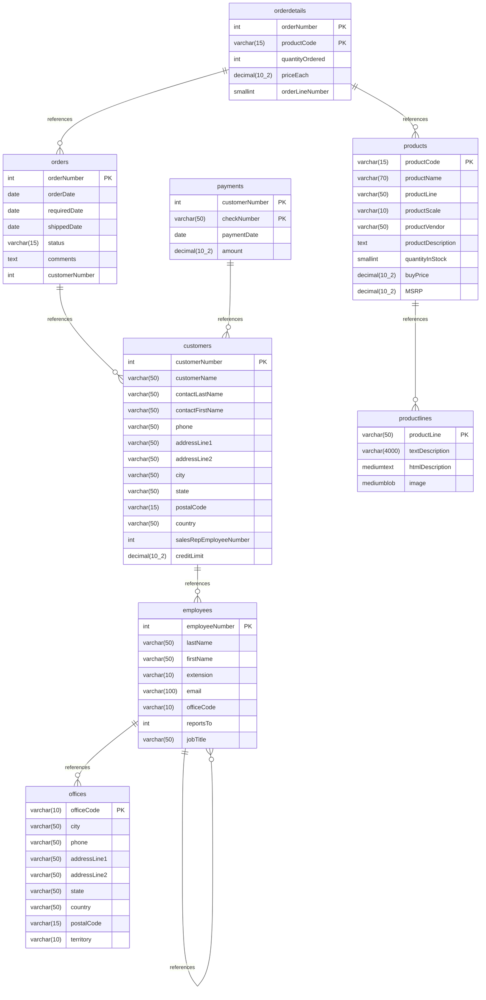

```mermaid
erDiagram
    customers {
        int customerNumber PK
        varchar(50) customerName
        varchar(50) contactLastName
        varchar(50) contactFirstName
        varchar(50) phone
        varchar(50) addressLine1
        varchar(50) addressLine2
        varchar(50) city
        varchar(50) state
        varchar(15) postalCode
        varchar(50) country
        int salesRepEmployeeNumber
        decimal(10_2) creditLimit
    }
    employees {
        int employeeNumber PK
        varchar(50) lastName
        varchar(50) firstName
        varchar(10) extension
        varchar(100) email
        varchar(10) officeCode
        int reportsTo
        varchar(50) jobTitle
    }
    offices {
        varchar(10) officeCode PK
        varchar(50) city
        varchar(50) phone
        varchar(50) addressLine1
        varchar(50) addressLine2
        varchar(50) state
        varchar(50) country
        varchar(15) postalCode
        varchar(10) territory
    }
    orderdetails {
        int orderNumber PK
        varchar(15) productCode PK
        int quantityOrdered
        decimal(10_2) priceEach
        smallint orderLineNumber
    }
    orders {
        int orderNumber PK
        date orderDate
        date requiredDate
        date shippedDate
        varchar(15) status
        text comments
        int customerNumber
    }
    payments {
        int customerNumber PK
        varchar(50) checkNumber PK
        date paymentDate
        decimal(10_2) amount
    }
    productlines {
        varchar(50) productLine PK
        varchar(4000) textDescription
        mediumtext htmlDescription
        mediumblob image
    }
    products {
        varchar(15) productCode PK
        varchar(70) productName
        varchar(50) productLine
        varchar(10) productScale
        varchar(50) productVendor
        text productDescription
        smallint quantityInStock
        decimal(10_2) buyPrice
        decimal(10_2) MSRP
    }
    customers ||--o{ employees : references
    employees ||--o{ employees : references
    employees ||--o{ offices : references
    orderdetails ||--o{ orders : references
    orderdetails ||--o{ products : references
    orders ||--o{ customers : references
    payments ||--o{ customers : references
    products ||--o{ productlines : references
```