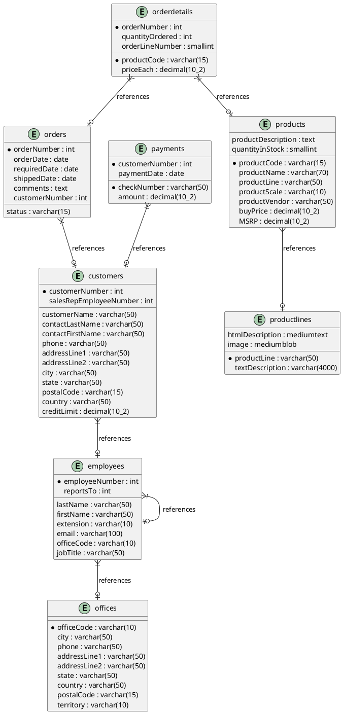

```plantuml
@startuml
entity customers {
  *customerNumber : int
  customerName : varchar(50)
  contactLastName : varchar(50)
  contactFirstName : varchar(50)
  phone : varchar(50)
  addressLine1 : varchar(50)
  addressLine2 : varchar(50)
  city : varchar(50)
  state : varchar(50)
  postalCode : varchar(15)
  country : varchar(50)
  salesRepEmployeeNumber : int
  creditLimit : decimal(10_2)
}
entity employees {
  *employeeNumber : int
  lastName : varchar(50)
  firstName : varchar(50)
  extension : varchar(10)
  email : varchar(100)
  officeCode : varchar(10)
  reportsTo : int
  jobTitle : varchar(50)
}
entity offices {
  *officeCode : varchar(10)
  city : varchar(50)
  phone : varchar(50)
  addressLine1 : varchar(50)
  addressLine2 : varchar(50)
  state : varchar(50)
  country : varchar(50)
  postalCode : varchar(15)
  territory : varchar(10)
}
entity orderdetails {
  *orderNumber : int
  *productCode : varchar(15)
  quantityOrdered : int
  priceEach : decimal(10_2)
  orderLineNumber : smallint
}
entity orders {
  *orderNumber : int
  orderDate : date
  requiredDate : date
  shippedDate : date
  status : varchar(15)
  comments : text
  customerNumber : int
}
entity payments {
  *customerNumber : int
  *checkNumber : varchar(50)
  paymentDate : date
  amount : decimal(10_2)
}
entity productlines {
  *productLine : varchar(50)
  textDescription : varchar(4000)
  htmlDescription : mediumtext
  image : mediumblob
}
entity products {
  *productCode : varchar(15)
  productName : varchar(70)
  productLine : varchar(50)
  productScale : varchar(10)
  productVendor : varchar(50)
  productDescription : text
  quantityInStock : smallint
  buyPrice : decimal(10_2)
  MSRP : decimal(10_2)
}
customers }|--o| employees : references
employees }|--o| employees : references
employees }|--o| offices : references
orderdetails }|--o| orders : references
orderdetails }|--o| products : references
orders }|--o| customers : references
payments }|--o| customers : references
products }|--o| productlines : references
@enduml
```